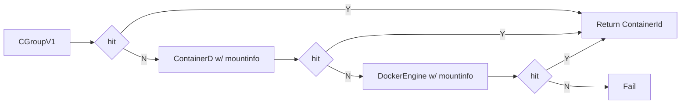
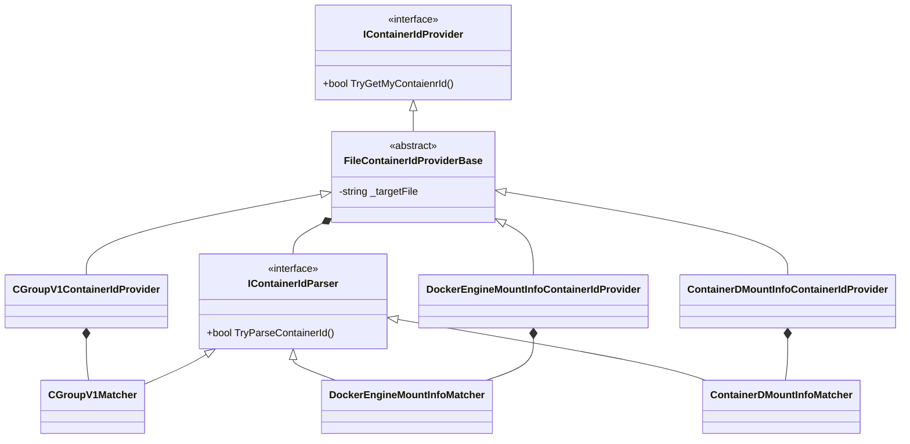

# Design

## Overview

Container id is useful. In telemetry, it helps locate exactly which instance, at when, events got emit.

_This design at this stage is specific to code running on **Linux**, we don't support getting container id on **Windows**._

### Cascading container id providers and why

We have multiple container id providers, trying to get different container ids from various locations. That is needed because there are various ways to get container id depending on the configurations, for example, is the host using `cgroupv1` or `cgroupv2`, is the runtime `docker engine` or `containerd`. 

Unfortunately, at this moment, there's no fully consistent way to get container id with in a docker container.

### Current fallbacks

Here's how the fallback happens today:

* Using info from `cgroupV1` has been working until `cgroupV2` becomes popular. And the container id is not easy to fetch any further.
* `MountInfo` is a practical substitution to get container ids, the mount point vars by different container runtime, thus `containerd with mountinfo` or `dockerengine with mountinfo`.

  With all those fallbacks, a **compromise** is that they all rely on implementations rather than abstractions. And implementations could change. It actually happened once for `cgroup v1` during the early ages. It is still expecting to happen until we have an abstraction to describe how to get container id with in a container.

* What happens when all of the info are failed? Today, it will return `string.Empty`.

### Implementing a container id provider

* Every class that implements IContainerIdProvider owns a way to provide the container id;
* File-based container id is an abstraction of the providers that get the info from a file, and composes a parser (matcher) to extract the container id from the content of the file.

### Contribution guideline

It is appreciated you considering contribute to `IContainerIdProvider`. Pick the right extension point saves you time and keeps the code consistent, and it boils down where the container id is fetched and how is it fetched.

* If it comes from a file (like `/proc/self/cgroup` or `/proc/self/mountinfo`), inherit `FileContainerIdProviderBase`; For testability, when possible, use the provider class as the composer of `IContainerIdParser`, and put the logic to identify container id in the parser - so that the parser could be easily tested.

* If it comes from somewhere else, an environemnt variable for example, implement `IContainerIdProvider`. It is recommended to having it compose a mather/parser unless it is very straightforward.